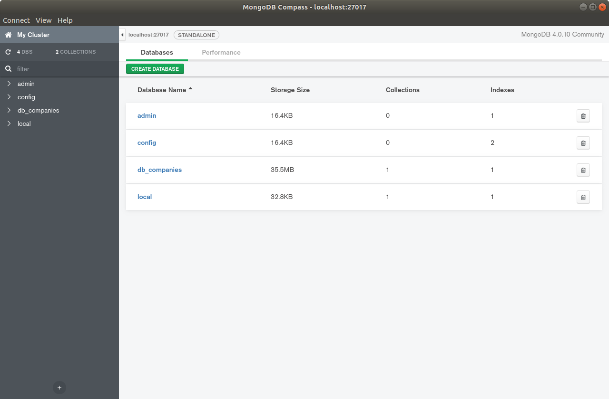
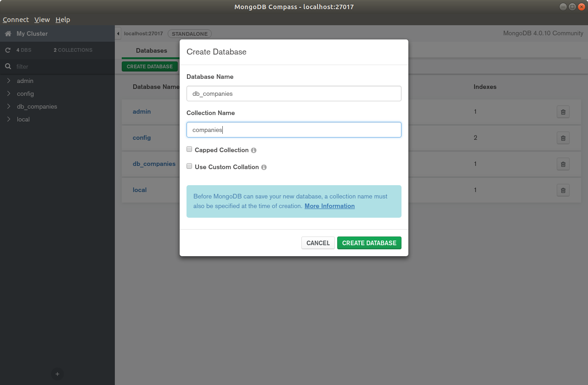
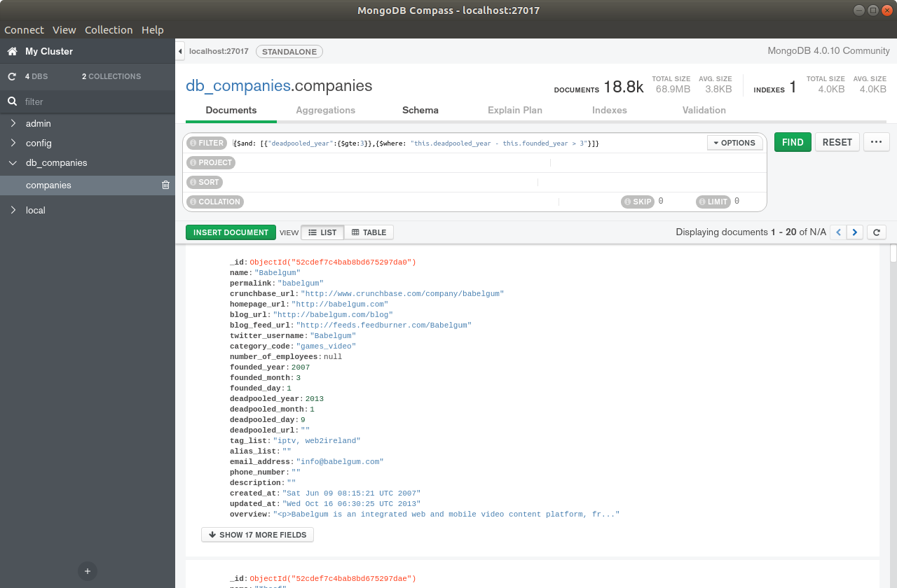

# pymongo-project

## 0. Intro
En este proyecto se pide seleccionar la ubicación de nuestra nueva sede en función de algunos parámetros a partir de una base de datos dada que contiene datos geoespaciales. La nueva sede es del departamento de videjuegos y queremos que haya servicios que gusten a nuestros empleados así como otras empresas de videjuegos exitosas. El criterio de definición de éxito será: 
* la empresa haya conseguido una financiación > 1M
* empresa que lleve abierta desde antes de 2003
* más de 10 empleados. 

En nuestro caso vamos a seleccionar las empresas del tipo: design, web, software, games_video, mobile, enterprise, analytics, search, network_hosting o photo_video. Que son similares o relacionadas con nuestro sector. 

## 1. Installation

### 1.1. Installation Mongo

Link: https://docs.mongodb.com/manual/tutorial/install-mongodb-on-ubuntu/

1. Ejecutar en terminal una a una los siguentes comandos. 
```
sudo apt-key adv --keyserver hkp://keyserver.ubuntu.com:80 --recv 9DA31620334BD75D9DCB49F368818C72E52529D4
echo "deb [ arch=amd64 ] https://repo.mongodb.org/apt/ubuntu bionic/mongodb-org/4.0 multiverse" | sudo tee /etc/apt/sources.list.d/mongodb-org-4.0.list
sudo apt-get update
sudo apt-get install -y mongodb-org
echo "mongodb-org hold" | sudo dpkg --set-selections
echo "mongodb-org-server hold" | sudo dpkg --set-selections
echo "mongodb-org-shell hold" | sudo dpkg --set-selections
echo "mongodb-org-mongos hold" | sudo dpkg --set-selections
echo "mongodb-org-tools hold" | sudo dpkg --set-selections
```

2. Comprobamos si el servicio funciona
```
sudo service mongod start
```
3. Comprobamos el log y debemos ver algo como **[initandlisten] waiting for connections on port 27017**
```
sudo cat /var/log/mongodb/mongod.log
```
4. Reiniciamos servicio
```
sudo service mongod stop
```
5. Iniciar servicio desde cero para dejarlo funcionando
```
sudo service mongod restart
```

### 1.2. Installation Compass
Link: https://docs.mongodb.com/compass/master/install/

1. descarga del link: https://www.mongodb.com/download-center/compass?jmp=hero
2. ejecuta el archivo descargado
3. Ahora tienes mongodb-compass entre tus programas


## 2. Importar base de datos a mongodb
1. iniciar mongodb 
```
sudo service mongod restart
```
2. Abrir compass en nuestro escritorio
3. create database (botón verde) y seleccionamos los campos Database name: db_companies, Collection name: companies. 




4. importar a mongo el json que queremos: 
```
mongoimport --db db_companies --collection companies companies.json
```

## 3. pymongo y filtrado

### 3.0 Inciamos mongodb

```
sudo service mongod restart
```

### 3.1 requirements
```Python
pip3 install pymongo
```

Ahora abrimos un jupyter notebook
```
jupyter notebook
```

### 3.2 Conexión con la base de datos

```Python
# imports
from pymongo import MongoClient
import pandas as pd

# conexión con  mongo
client = MongoClient("mongodb://localhost:27017/")

# conexión con la base de datos "db_companies"
db = client.db_companies

#coleción companies
collection_companies = db.companies

# query pidiendo TODO
query = collection_companies.find()

# convertimos a pandas.DataFrame
df = pd.DataFrame(query)
```

### 3.3 Filtramos 
Como queremos trasladarnos a una sede donde haya empresas similares que hayan triunfado. Reducimos el número de empresas según el criterio descrito en la intro. En compass se puede hacer por ejemplo:
```c
{$and:[{number_of_employees: {$gt: 10}}, {founded_year: {$lt: 2003}}, { $or: [ {category_code:"design"}, {category_code:"games_video"}, {category_code:"web"} ] } ]}
```

Pero nuestra query será más compleja para no traernos demasiados valores nulos. 
```c
companies = collection_companies.find({"$and":[
                                {"offices": {"$exists": True}},
                                {"offices": {"$ne": None}}, 
                                {"category_code": {"$exists": True}},
                                {"category_code": {"$ne": None}}, 
                                {"founded_year": {"$exists": True}}, 
                                {"founded_year": {"$gte": 2003}},
                                {"deadpooled_year": None},
                                {"number_of_employees": {"$exists": True}},
                                {"number_of_employees": {"$gte": 10}},
                                {"total_money_raised": {"$exists": True}},
                                {"total_money_raised":{"$ne":None}},
                                {"total_money_raised": {"$not":{"$size":0}}}, 
                                {"$or": [
                                    {"total_money_raised": {"$gte": 1_000_000}},
                                    {"category_code": "design" } ,
                                    {"category_code": "web" } , 
                                    {"category_code": "software" } , 
                                    {"category_code": "games_video" } , 
                                    {"category_code": "mobile" } , 
                                    {"category_code": "enterprise" } ,   
                                    {"category_code": "analytics" } ,
                                    {'category_code': "search"},
                                    {'category_code': "network_hosting"} ,   
                                    {"category_code": "photo_video" } ,   
                                    ]} ,
                                      
                                ]
                                },
                                
                                # descartamos elementos que no interesan
                                {"_id": 0, "crunchbase_url": 0, "products": 0, 
                                 "acquisition": 0, "acquisitions": 0, "video_embeds": 0, 
                                 "screenshots": 0, "external_links": 0, "partners": 0, 
                                 "image": 0
                                }
                                     )
```

## 4. Limpieza

